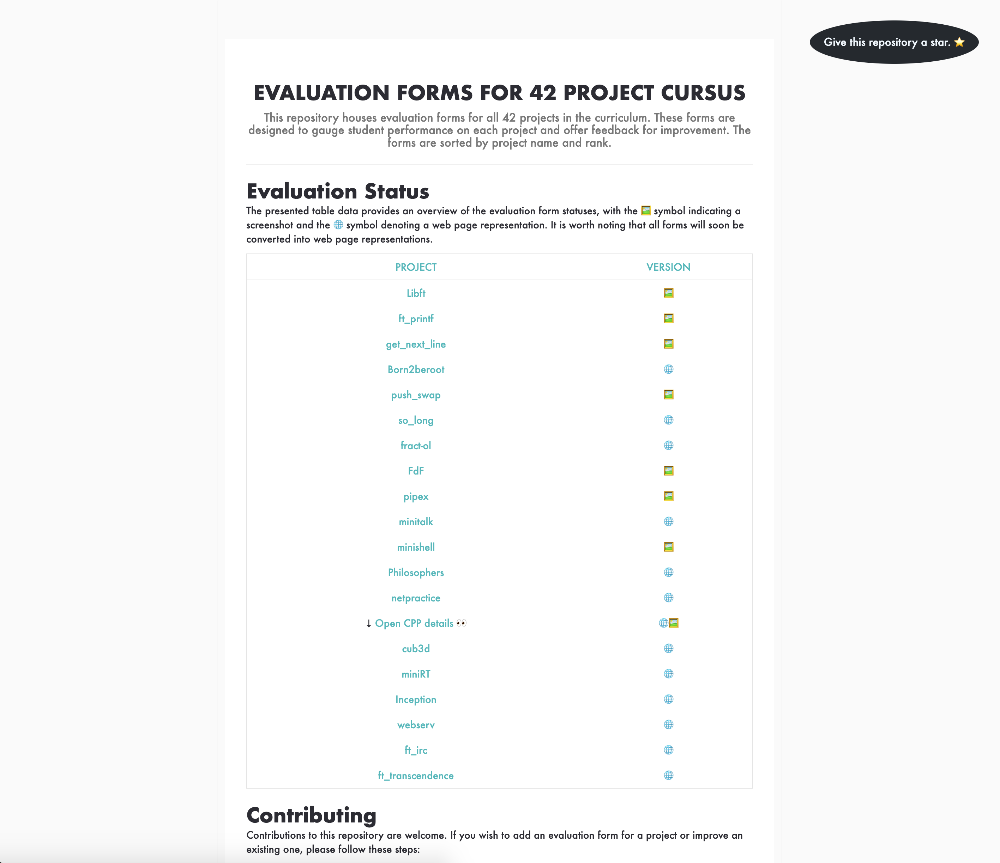

# 42 Project Evaluation Sheets Hub 🎯

Welcome to the heart of self-evaluation for 42 School projects! 📝 Whether you're gearing up for a peer-evaluation or refining your code masterpiece, these sheets offer a sneak peek into the evaluation process, setting you up for success. 🌟

Dive into my meticulously curated evaluation sheets, sourced directly from the official 42 School, and fine-tune your projects to ace that evaluation. For the most immersive experience, check out the [42-Evals Web Page](https://enzodeg40.github.io/42-Evals) - your digital companion for project assessments, updated regularly for seamless access. 🖥️✨

## Contributing to Excellence 🤝

Your insight and expertise can help countless peers! If you've got an evaluation sheet that could illuminate the path to project perfection, here's how to share that beacon of knowledge:

1. Fork the repository.
2. Clone your fork and embark on your contribution journey.
3. Add new enlightenment or polish existing treasures.
4. Commit your wisdom with a meaningful message.
5. Push your contributions upstream.
6. Open a pull request to merge your light into the main beacon.

## Navigating the Sheets 🗺️

Each sheet is a roadmap to understanding the intricate expectations of each project. Use them to self-evaluate, discover areas for improvement, and prepare for the peer-evaluation journey that awaits. Review, reflect, and resonate with the criteria that define project success.

## Complementary Resources 🌐

For a holistic learning journey, don't forget to explore the [42-Subjects](https://github.com/rphlr/42-Subjects/) repository. It's an expansive archive of official project PDFs, in both English and French, aligning perfectly with these evaluation sheets.
